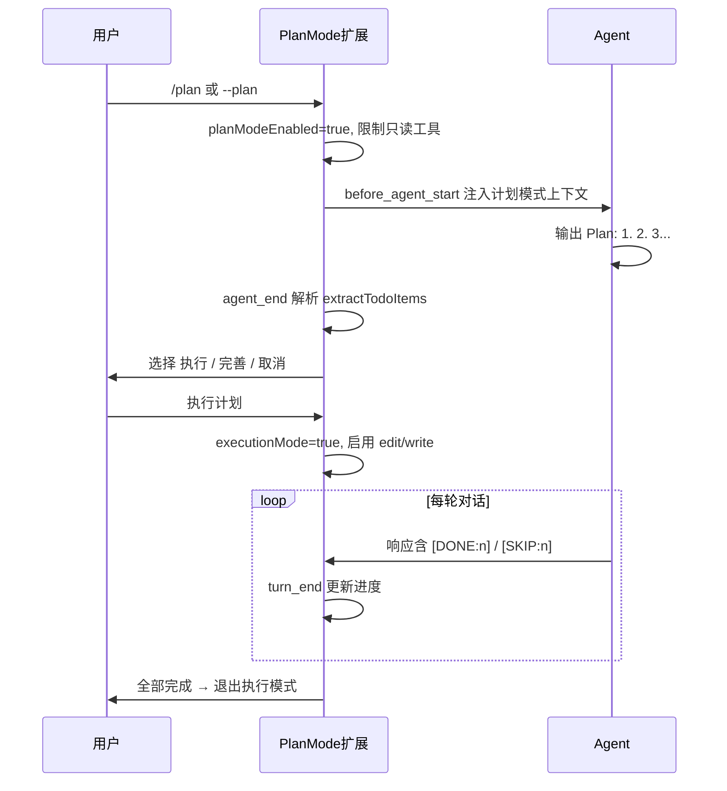

# Plan Mode Extension (优化版)

安全的只读探索模式，用于代码分析和计划制定。

## ✨ 改进特性

### 🎨 UI 改进
- **进度条可视化** - 使用 `█░` 字符显示执行进度
- **Emoji 图标** - ✅ 完成 / ⬜ 待执行 / ⏭️ 跳过 / 🚀 执行中
- **中文界面** - 所有提示和状态信息使用中文
- **实时状态栏** - 底部显示当前模式和进度
- **小组件显示** - 详细的任务列表和进度信息

### 🔄 流程改进
- **更清晰的模式切换** - 计划模式 → 执行模式 → 正常模式
- **步骤跳过支持** - 使用 `[SKIP:n]` 标记跳过步骤（`n` 为 Plan 中的原始编号）
- **管道命令支持** - `ls | head`、`cmd 2>/dev/null` 等只读组合可放行
- **自动完成检测** - 所有步骤完成后自动退出执行模式

### 📊 进度跟踪
- **进度条** - 可视化显示完成百分比
- **编号一致** - 列表显示、`[DONE:n]`、`[SKIP:n]` 均使用 Plan 中的步骤号

## 📦 安装

将以下文件放到 `~/.pi/extensions/plan-mode/` 目录：

```
~/.pi/extensions/plan-mode/
├── index.ts        # 主扩展文件
├── utils.ts        # 工具函数
├── utils.test.ts   # 单元测试
└── README.md       # 本文档
```

## 🔁 生命周期（index.ts）



| 钩子 | 作用 |
|------|------|
| `session_start` | 恢复 `--plan` 标志与会话持久化状态；resume 时重放 `[DONE]`/`[SKIP]` |
| `tool_call` | 计划模式下拦截不安全的 `bash` 命令 |
| `context` | 退出计划模式后过滤陈旧的计划上下文消息 |
| `before_agent_start` | 注入计划模式或执行模式提示 |
| `turn_end` | 解析 `[DONE:n]`、`[SKIP:n]`，更新 UI 与持久化 |
| `agent_end` | 解析 Plan、展示选择菜单、切换执行/取消 |

持久化通过 `pi.appendEntry("plan-mode", { enabled, todos, executing })` 写入会话。

## 🎯 使用方法

### 命令
- `/plan` - 切换计划模式
- `/todos` - 显示当前计划进度

### 快捷键
- `Ctrl+Alt+P` - 切换计划模式

### 工具列表

| 模式 | 可用工具 |
|------|----------|
| 计划模式 | `read`, `bash`（只读）, `grep`, `find`, `ls` |
| 执行模式 | 上述 + `edit`, `write` |
| 正常模式 | 同执行模式 |

### 工作流程

1. `/plan` 启用计划模式
2. 让 AI 分析并输出 `Plan:\n1. ...\n2. ...`
3. 选择 **🚀 执行计划**（无步骤时会提示警告）
4. AI 每完成一步输出 `[DONE:n]`（`n` 必须与 Plan 编号一致）
5. 全部完成后自动显示摘要并恢复工具

## 🔒 安全特性

### 命令检查逻辑

- 按 `|`、`&&`、`||`、`;` 拆成多段，**每段**须匹配只读白名单
- 允许 `2>/dev/null`、`2>&1`、`&>/dev/null`；禁止 `>`、`>>` 写入文件
- 仅拦截 Pi 的 `bash` 工具；其他宿主（如 Cursor MCP）可能不受此限制

### 允许的命令（每段开头须匹配）
- 文件查看: `cat`, `head`, `tail`, `less`, `more`, `bat`
- 搜索: `grep`, `find`, `rg`, `fd`
- 目录: `ls`, `pwd`, `tree`, `du`, `df`
- Git 只读: `git status`, `git log`, `git diff`, `git show`, `git rev-parse`, `git branch`, `git ls-*`
- 包信息: `npm list`, `npm outdated`, `yarn info`

### 阻止的命令
- 文件修改: `rm`, `mv`, `cp`, `mkdir`, `touch`
- Git 写入: `git add`, `git commit`, `git push`, `git checkout`（等）
- 包安装: `npm install`, `yarn add`, `pip install`
- 输出重定向写文件: `> file`, `>> file`
- 系统: `sudo`, `kill`, `reboot`
- 编辑器: `vim`, `nano`, `code`

## 🧪 测试

```bash
npx tsx extensions/plan-mode/utils.test.ts
```

## 📝 示例

```
用户: /plan
AI: Plan:
    1. 分析认证逻辑
    2. 实现修改
用户: [执行计划]
AI: ... [DONE:1]
AI: ... [DONE:2]
系统: 🎉 计划执行完成！
```

若 Plan 使用跳号（如 `1.` 后直接 `5.`），须使用 `[DONE:5]` 而非列表序号。

## 🔧 配置

```bash
pi --plan   # 以计划模式启动
```

## 🐛 故障排除

### 计划没有被识别
确保使用 `Plan:` 标题与 `1.` / `2.` 编号列表。

### 命令被阻止
- 确认每段管道均为只读命令
- 避免 `2>/dev/null` 以外的重定向
- 需要修改文件时使用 `/plan` 退出计划模式，或进入执行模式

### 进度没有更新
- `[DONE:n]` 的 `n` 必须与 Plan 中编号一致
- 跳过使用 `[SKIP:n]`

### Cursor / 其他 IDE
MCP 工具（如 `mcp_pi_bash`）可能不经过 `tool_call` 拦截，请勿依赖计划模式在跨宿主环境下的写保护。

## 📜 许可

MIT License
